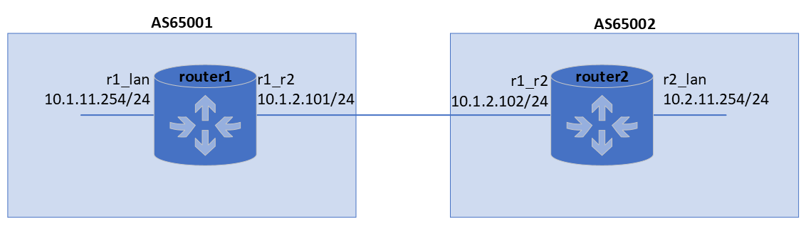
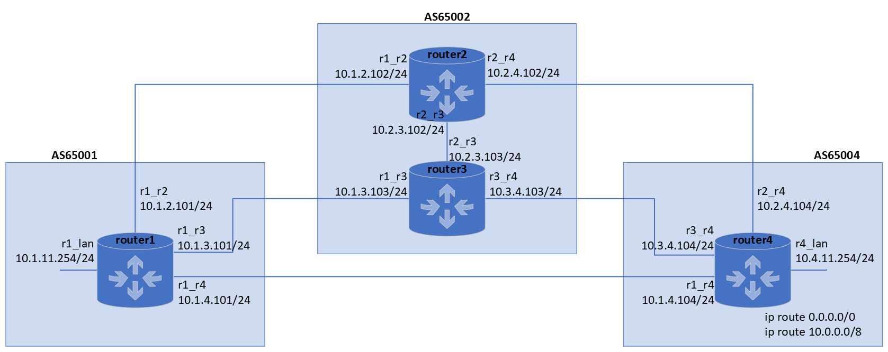

docker_bird_bgp
===============

BGP routing examples based on `BIRD`_ and `docker`_.
This repository contains 2 examples (simple and advanced) that help you understand how BIRD flies.
Feel free to change the configs, enjoy the game.

.. contents::

.. sectnum::

Download sandbox
----------------

.. code:: bash

    git clone https://github.com/vladimirs-git/docker_bird_bgp.git
    cd docker_bird_bgp

Simple config
-------------
|diagram1|

BIRD configs

router1
.. code:: text

	router id 10.0.0.1;

	protocol kernel {
	  metric 0;
	  import none;
	  learn;
	  export all;
	}

	protocol device {
	}

	protocol direct {
	}

	protocol bgp router2 {
	  local as 65001;
	  neighbor 10.1.2.102 as 65002;
	  import all;
	  export all;
	}

router2
.. code:: text

	router id 10.0.0.2;

	protocol kernel {
	  metric 0;
	  import none;
	  learn;
	  export all;
	}

	protocol device {
	}

	protocol direct {
	}

	protocol bgp router1 {
	  local as 65002;
	  neighbor 10.1.2.101 as 65001;
	  import all;
	  export all;
	}

Dockers up

.. code:: bash

    docker-compose -f docker-compose1.yml up -d

BIRD show output

.. code:: bash

    docker-compose -f docker-compose1.yml exec router1 bash

    root@router1:/# birdc
    BIRD 1.6.6 ready.

    bird> show protocol 
    name     proto    table    state  since       info
    kernel1  Kernel   master   up     19:59:57
    device1  Device   master   up     19:59:57
    direct1  Direct   master   up     19:59:57
    router2  BGP      master   up     20:00:01    Established
    
    bird> show route
    10.1.11.0/24       dev eth0 [direct1 19:59:57] * (240)
    10.2.11.0/24       via 10.1.2.102 on eth1 [router2 20:00:01] * (100) [AS65002i]
    10.1.2.0/24        dev eth1 [direct1 19:59:57] * (240)
                       via 10.1.2.102 on eth1 [router2 20:00:01] (100) [AS65002i]

    bird> exit
    root@router1:/# exit

Dockers down

.. code:: bash

    docker-compose -f docker-compose1.yml down

Advanced config
---------------
|diagram2|

Dockers up

.. code:: bash

    docker-compose -f docker-compose2.yml up -d

BIRD show output

.. code:: bash

    docker-compose -f docker-compose2.yml exec router1 bash

    root@router1:/# birdc
    BIRD 1.6.6 ready.

    bird> show protocol
    name     proto    table    state  since       info
    kernel1  Kernel   master   up     20:01:24
    device1  Device   master   up     20:01:24
    direct1  Direct   master   up     20:01:24
    router2  BGP      master   up     20:01:28    Established
    router3  BGP      master   up     20:01:28    Established
    router4  BGP      master   up     20:01:27    Established

    bird> show route
    0.0.0.0/0          via 10.1.4.104 on eth3 [router4 20:01:26] ! (100) [AS65004i]
                       via 10.1.2.102 on eth1 [router2 20:01:27] (100) [AS65004i]
                       via 10.1.3.103 on eth2 [router3 20:01:27] (100) [AS65004i]
    10.1.11.0/24       dev eth0 [direct1 20:01:23] * (240)
    10.0.0.0/8         via 10.1.2.102 on eth1 [router2 20:01:27] * (100) [AS65004i]
                       via 10.1.3.103 on eth2 [router3 20:01:27] (100) [AS65004i]
                       via 10.1.4.104 on eth3 [router4 20:01:26] (100) [AS65004i]
    10.1.4.0/24        dev eth3 [direct1 20:01:23] * (240)
    10.1.2.0/24        dev eth1 [direct1 20:01:23] * (240)
    10.1.3.0/24        dev eth2 [direct1 20:01:23] * (240)

    bird> show route all where net = 10.0.0.0/8
    10.0.0.0/8         via 10.1.2.102 on eth1 [router2 20:01:27] * (100) [AS65004i]
            Type: BGP unicast univ
            BGP.origin: IGP
            BGP.as_path: 65002 65004
            BGP.next_hop: 10.1.2.102
            BGP.local_pref: 100
            BGP.community: (65004,2)
                       via 10.1.3.103 on eth2 [router3 20:01:27] (100) [AS65004i]
            Type: BGP unicast univ
            BGP.origin: IGP
            BGP.as_path: 65002 65004
            BGP.next_hop: 10.1.3.103
            BGP.local_pref: 100
            BGP.community: (65004,2)
                       via 10.1.4.104 on eth3 [router4 20:01:26] (100) [AS65004i]
            Type: BGP unicast univ
            BGP.origin: IGP
            BGP.as_path: 65004 65004 65004
            BGP.next_hop: 10.1.4.104
            BGP.local_pref: 100

    bird> show route protocol router4
    0.0.0.0/0          via 10.1.4.104 on eth3 [router4 20:01:26] ! (100) [AS65004i]
    10.0.0.0/8         via 10.1.4.104 on eth3 [router4 20:01:26] (100) [AS65004i]

    bird> show route export router4
    10.1.11.0/24       dev eth0 [direct1 20:01:24] * (240)

    bird> exit
    root@router1:/# exit

Dockers down

.. code:: bash

    docker-compose -f docker-compose2.yml down

.. _`BIRD`: https://bird.network.cz/
.. _`docker`: https://www.docker.com/

